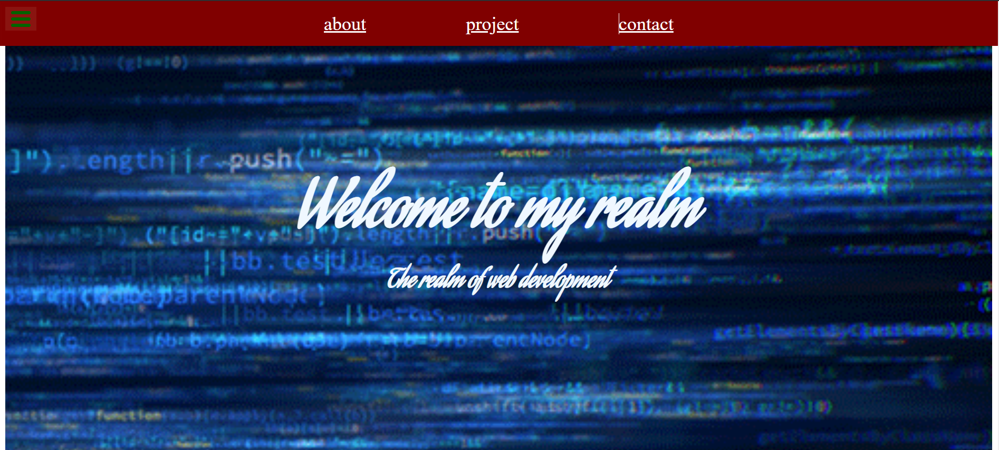
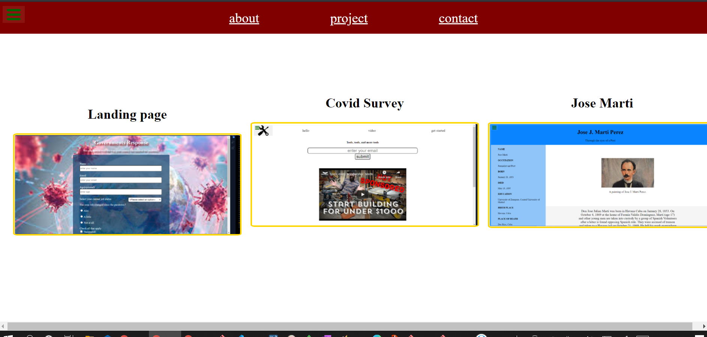
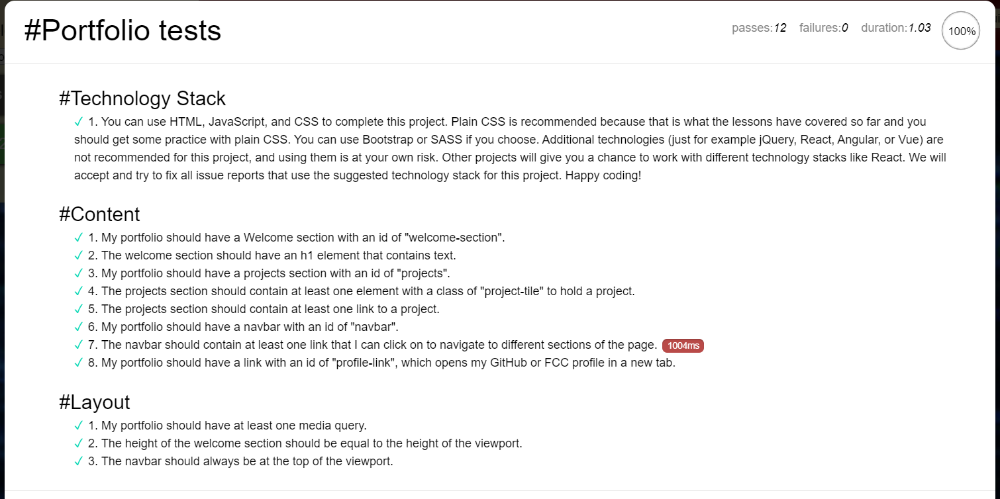

# Personal Portfolio

## Description

## Portfolio , plain CSS...

CSS grid project

## Table of content

---

- [Description](#description)
- [Support/Questions](#supportquestions)
- [License](#license)

> **_get started_**:

- html
- CSS

---

---

---

> **_Find me on Github:_**

**_At Github:_**
<https://github.com/Rauloropesa3/personal_portfolio-webpage.git>

**_or on the web:_**
<https://rauloropesa3.github.io/personal_portfolio-webpage/>

- MIT License

  <https://opensource.org/license/>
